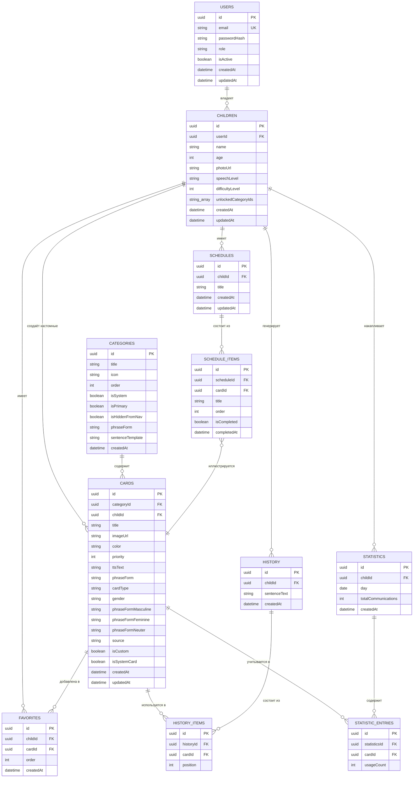

# DATABASE.md — Autism Connect MVP

СУБД: **PostgreSQL**. ORM: **Prisma**. Все сущности из раздела 12 ТЗ + служебные таблицы, необходимые для реализации связей (`Favorites` как связка many-to-many, `ScheduleItems` как элементы расписания).

---

## 1. ER-диаграмма

---

## 2. Описание таблиц

### 2.1 `users`
Родитель/специалист/админ, аутентифицируется через email + JWT.

| Поле | Тип | Описание |
|---|---|---|
| id | UUID (PK) | |
| email | string, unique | |
| passwordHash | string | bcrypt/argon2 хэш |
| role | enum: `PARENT`, `SPECIALIST`, `ADMIN` | задел под роль специалиста (Phase 2); `ADMIN` — админ-панель (см. §5) |
| isActive | boolean, default `true` | **редакция 3 механики.** Блокировка родительского аккаунта админом (`PATCH /admin/users/:id/status`). Проверяется в `AuthService` при логине и при рефреше токена — заблокированный пользователь не может получить ни новый access/refresh, ни продлить существующую сессию, а не только не пройти отдельный guard-чек постфактум. |
| createdAt / updatedAt | datetime | |

### 2.2 `children`
Профиль ребёнка, привязан к родителю.

| Поле | Тип | Описание |
|---|---|---|
| id | UUID (PK) | |
| userId | UUID (FK → users.id) | |
| name | string | |
| age | int | |
| photoUrl | string, nullable | |
| speechLevel | enum: `NONE`, `SINGLE_WORDS`, `PHRASES`, `SENTENCES` | |
| favoriteCategories | связь many-to-many с `categories` через join-таблицу `child_favorite_categories` (см. ниже) | |
| difficultyLevel | int, `1 \| 2 \| 3`, default `1` | **редакция 3 механики (§5.2).** Раньше уровень определял сборку фразы (1 — мгновенно; 2 — строка сборки; 3 — + шаг прилагательного). **С редакции 4 (TASK_GRID_AND_TTS.md §B.4) на озвучивание не влияет** — карточка произносит свою `ttsPhrase` независимо от уровня. Поле и код уровней сохранены до решения заказчика (см. отчёт по задаче). |
| unlockedCategoryIds | string[] (UUID), default `[]` | Категории-глаголы, доступные ребёнку, настраивается родителем. Категория "Дай" (`Category.isPrimary`) доступна **всегда**, независимо от присутствия в этом списке — это проверяется в коде (frontend/backend), а не отсутствием ограничения на уровне БД. |
| cardSize | enum: `SMALL`, `MEDIUM`, `LARGE`, default `SMALL` | Легаси (редакция 3): пресет размера карточек. С редакции 4 размер задаётся числом карточек на экране (`cardsPerPage`) и адаптивной сеткой; колонка оставлена, UI её не меняет. |
| cardsPerPage | int, default `6` | **Редакция 4 (TASK_GRID_AND_TTS.md §A.2).** Сколько карточек показывать на одном экране (2–10). Задаёт и размер плиток (адаптивная сетка `repeat(cols, 1fr)` делит ширину), и порог клиентской пагинации. Настраивается в режиме редактирования экрана ребёнка. |

> Примечание: "Любимые категории" из раздела 6.2 ТЗ реализуются отдельной join-таблицей `child_favorite_categories(childId, categoryId)`, а не полем-массивом, чтобы сохранить нормализацию и связь с реальными категориями. `unlockedCategoryIds`, в отличие от этого, хранится как массив UUID прямо на `children` — это узкоспециализированный список выбора из фиксированного (по числу) набора глагольных категорий, а не полноценная связь, требующая собственных атрибутов (`order` и т.п.).

### 2.3 `categories`
**Редакция 3 механики (§5.1).** Категория теперь — это сам глагол/просьба ("Дай", "Болит", "Идти", "Есть", "Мыться"), а не тематическая группа предметов (Еда/Напитки/...). Также используется для двух служебных категорий-контейнеров, скрытых из навигации: карточек-прилагательных ("Признаки") и системных карточек Да/Нет ("Служебные").

| Поле | Тип | Описание |
|---|---|---|
| id | UUID (PK) | |
| title | string | Сам глагол/просьба в исходной форме: "Дай", "Болит", ... |
| icon | string | ключ из реестра Tabler Icons (`packages/ui/src/icons/registry.ts`) |
| color | string | hex, используется для пилюли категории и заливки её карточек |
| order | int | порядок отображения |
| isSystem | boolean | защита базовых категорий от удаления через UI |
| isPrimary | boolean, default `false` | `true` только у категории "Дай" — всегда доступна ребёнку и всегда в акцентном цвете пилюли, независимо от `Child.unlockedCategoryIds` и статуса "активна ли вкладка". |
| isHiddenFromNav | boolean, default `false` | Служебная категория-контейнер (Да/Нет, прилагательные) — не возвращается `GET /categories` и не рендерится пилюлей в зоне ребёнка; карточки внутри неё достаются напрямую через `GET /cards?cardType=...` / `?isSystemCard=true`, без обращения к самой категории. |
| phraseForm | string | Легаси (редакция 3): словоформа глагола для сборки фразы. **С редакции 4 для озвучивания не используется** — фраза целиком хранится на карточке (`Card.ttsPhrase`). Переименование раздела (`title`) не влияет на фразы его карточек. |
| sentenceTemplate | string, default `"{verb} {noun}"` | Легаси (редакция 3): шаблон сборки фразы. **С редакции 4 для озвучивания не используется** (см. `Card.ttsPhrase`). Оставлен в схеме, т.к. на него ещё ссылается `sentenceEngine.ts` (движок сборки сохранён под уровни сложности, но из TTS-пути на экране ребёнка исключён). |

### 2.4 `cards`
Ключевая сущность. **Редакция 3 механики:** карточка теперь бывает двух типов — существительное (`cardType: NOUN`, попадает в конкретную глагольную категорию) или прилагательное (`cardType: ADJECTIVE`, попадает в служебную категорию "Признаки" и согласуется по роду с выбранным существительным). Библиотека сеется через `packages/database/prisma/seed.ts` / `seed-data.ts`, не хардкодится в коде приложения.

| Поле | Тип | Описание |
|---|---|---|
| id | UUID (PK) | |
| categoryId | UUID (FK → categories.id) | |
| childId | UUID (FK → children.id), nullable | заполняется только для кастомных карточек конкретного ребёнка (раздел 6.12 ТЗ); NULL — карточка из общей библиотеки |
| title | string | именительный падеж, отображается на карточке |
| imageUrl | string, nullable | Относительный путь к картинке на диске backend (`/uploads/cards/<файл>`, того же origin — Next.js проксирует `/uploads` на backend, см. ARCHITECTURE.md §4.5); `NULL` до первой загрузки картинки через `POST /cards/:id/image` (см. §3) — на карточке рендерится иконка-заглушка вместо изображения |
| color | string | hex |
| priority | int | влияет на сортировку |
| ttsPhrase | string, default `""` | **Редакция 4 (TASK_GRID_AND_TTS.md §B).** Полная фраза озвучивания, задаётся на карточке целиком ("Идём во двор", "Болит голова", "Дай пить"). Именно это произносится при выборе карточки — фраза больше не собирается программно из `Category.phraseForm` + `Card.phraseForm` + `Category.sentenceTemplate`. Редактируется на карточке (поле «Что произносить») отдельно от подписи `title`. |
| ttsText | string | Легаси: раньше — текст озвучивания служебных карточек (Да/Нет) и fallback. Теперь озвучивание идёт через `ttsPhrase`; поле сохранено (миграция бэкфиллит `ttsPhrase = ttsText`). |
| phraseForm | string | Легаси (прежняя сборка фразы из частей, редакция 3): падеж существительного / словарная форма прилагательного. Для озвучивания больше не источник (см. `ttsPhrase`). |
| cardType | enum: `NOUN`, `ADJECTIVE`, default `NOUN` | |
| gender | enum: `MASCULINE`, `FEMININE`, `NEUTER`, nullable | Только для `NOUN` — собственный грамматический род существительного, по нему прилагательное выбирает нужную словоформу. |
| phraseFormMasculine / phraseFormFeminine / phraseFormNeuter | string, nullable | Только для `ADJECTIVE` — три явные словоформы по родам (ТЗ прямо требует явные формы на карточке, не автогенерацию по правилам грамматики). |
| source | enum: `LIBRARY`, `CUSTOM`, `AI_GENERATED` | задел под Phase 2/3 AI-генерацию (раздел 14 ТЗ) без изменения схемы |
| isCustom | boolean | быстрый флаг для выборок "мои карточки" |
| isSystemCard | boolean, default `false` | `true` только у ровно двух карточек — "Да" и "Нет". Не входят в сетку категории, рендерятся отдельной sticky-панелью в зоне ребёнка и озвучиваются собственным `ttsText` напрямую, минуя шаблон `{verb} {noun}`. Исключаются из `GET /cards` по умолчанию (нужен явный `isSystemCard=true`). |

### 2.5 `favorites`
Закреплённые карточки конкретного ребёнка (раздел 6.7 ТЗ).

| Поле | Тип |
|---|---|
| id | UUID (PK) |
| childId | UUID (FK) |
| cardId | UUID (FK) |
| order | int — порядок отображения "первыми" |

Уникальный составной индекс `(childId, cardId)`, чтобы карточка не дублировалась в избранном.

### 2.6 `history` / `history_items`
Хранение последних 100 предложений на ребёнка (раздел 6.10 ТЗ).

- `history` — само предложение целиком (для быстрого вывода списком): `sentenceText`, `createdAt`.
- `history_items` — из каких именно карточек (в каком порядке) собрано предложение — для статистики использования карточек.

Ограничение "последние 100" реализуется не на уровне схемы, а как правило приложения (background job или триггер очистки старых записей свыше 100 на `childId`), либо через партиционирование/lazy-cleanup в сервисе `HistoryModule`.

> **Редакция 3 механики:** категория-глагол не является карточкой, поэтому фразу "Дай яблоко" нельзя восстановить склейкой одних только `ttsText` карточек. `POST /history` принимает необязательный `sentenceText` — если передан, используется как есть (так фронтенд логирует результат `sentenceEngine.buildSentenceText`); если нет — бэкенд склеивает `ttsText` карточек по порядку, как раньше (обратная совместимость для прямых интеграций).

### 2.7 `schedules` / `schedule_items`
Визуальное расписание (раздел 6.11 ТЗ).

- `schedules` — расписание (может быть несколько шаблонов на ребёнка: "утро", "вечер").
- `schedule_items` — шаги расписания по порядку, каждый опционально привязан к карточке (`cardId`) для иллюстрации шага, с флагом `isCompleted` и `completedAt` — что отмечает ребёнок.

### 2.8 `statistics` / `statistic_entries`
Агрегированная статистика по дням (раздел 6.13 ТЗ).

- `statistics` — одна запись на ребёнка на день: `totalCommunications`.
- `statistic_entries` — разбивка по карточкам за этот день: `usageCount` на каждую `cardId`.

Такое разделение позволяет строить и "активность по дням" (агрегат `statistics`), и "самые используемые карточки" (агрегат по `statistic_entries` за период) без пересчёта из сырой истории на каждый запрос.

---

## 3. Хранение изображений и админ-панель (Part B техзадания)

Схема БД не заводит отдельную таблицу под админ-панель — она целиком оркестрирует существующие `users`/`cards` через новый бэкенд-модуль `apps/backend/src/modules/admin`, без своего домена/агрегата:

- **Загрузка/замена картинки карточки** — `POST /cards/:id/image` (multipart, поле `file`, любой авторизованный родитель — не только `ADMIN`, см. `cards.controller.ts`). Файл валидируется на бэкенде (не только на фронтенде): mime-type строго `image/jpeg|png|webp`, размер ≤ 5 МБ (`apps/backend/src/storage/card-image-validator.ts`). Сохраняется на диск backend-контейнера через `StorageService` (`apps/backend/src/storage`) — масштаб проекта (один инстанс backend, без горизонтального масштабирования) не оправдывает S3-совместимое хранилище; результирующий относительный путь (`/uploads/cards/<файл>`) пишется в `cards.imageUrl` тем же `CardRepository.update`, которым пользуется обычный `UpdateCardUseCase`. Замена картинки и удаление карточки удаляют старый файл с диска (`StorageService.deleteCardImage`), чтобы не копить файлы-сироты.
  - **Ресайз/сжатие на загрузке (sharp).** Исходный файл (до нескольких МБ с телефона) уменьшается до ≤640px по длинной стороне и перекодируется в WebP (качество 82) — карточка никогда не рендерится крупнее нескольких сотен px даже в адаптивной сетке на планшете (TASK_GRID_AND_TTS.md §A), так что хранить/отдавать оригинал избыточно. Это была основная причина долгой загрузки картинок на мобильном/через cloudflared-туннель — не сеть, а вес самого файла (замер: JPEG ~3.8 МБ → WebP ~110 КБ). EXIF-поворот с телефона учитывается (`.rotate()`) до ресайза. Битый/повреждённый файл, прошедший поверхностную mime/size-проверку, тоже превращается в `InvalidImageFileException`, а не в 500.
  - Файлы отдаются самим backend через `app.useStaticAssets` (см. `main.ts`) по префиксу `/uploads/cards/`, с `Cache-Control: public, max-age=31536000, immutable` — имя файла всегда новый случайный UUID (замена картинки создаёт новый файл, не перезаписывает старый), поэтому конкретный URL можно кэшировать агрессивно без риска отдать устаревшую картинку. Браузер грузит их относительным путём того же origin, что и сайт; Next.js проксирует `/uploads` на backend (`next.config.js` rewrites, см. ARCHITECTURE.md §4.5) — работает и снаружи (мобильный/туннель), без абсолютного адреса backend в URL.
  - `UPLOAD_DIR` — путь на диске backend-контейнера (см. `.env.example`). `PUBLIC_BASE_URL` больше не используется: URL картинки относительный, хост backend в него не зашивается.
  - **Заполнение библиотеки символами с opensymbols.org** — `packages/database/scripts/fetch-opensymbols-images.mjs` (по запросу заказчика: библиотечные карточки не должны оставаться без картинки). Запускать нужно из окружения с обычным доступом в интернет и с `OPENSYMBOLS_ACCESS_TOKEN` — из песочницы Claude Code скрипт не запустить, сетевая политика блокирует opensymbols.org. Подробности — в шапке самого скрипта.
- **Список/блокировка родительских аккаунтов** — `GET /admin/users` (пагинация, только `role: PARENT`), `PATCH /admin/users/:id/status` (`isActive`). Ограничение "только PARENT" — намеренное: через эту панель нельзя заблокировать другого `ADMIN`/`SPECIALIST` (см. `OnlyParentAccountsManageableException`).
- **Создание родительского аккаунта** (TASK_PATCH_3 §5) — `POST /admin/users` (`{ email }`), роль всегда `PARENT` — создание других `ADMIN` через эту ручку не входит в задачу. Email проверяется на уникальность (409 `EMAIL_ALREADY_REGISTERED`, тот же класс исключения, что и в `RegisterUseCase`) и на формат (`@IsEmail()` на бэкенде, не только фронтенд). Пароль — сгенерированный временный, тем же механизмом, что и сброс пароля ниже.
- **Сброс пароля** — `POST /admin/users/:id/reset-password` генерирует случайный временный пароль, хэширует и сохраняет его, **возвращает пароль в ответе API**. **TODO(безопасность, MVP-упрощение, см. код):** нет email-канала восстановления и нет принудительной смены пароля при следующем входе — сознательное упрощение MVP, не финальный дизайн; отмечено `TODO` в `apps/backend/src/modules/admin/application/generate-temporary-password.ts`.
- **Доступ строго `role: ADMIN`** — `RolesGuard` + `@Roles("ADMIN")` (`apps/backend/src/common/guards/roles.guard.ts`), зарегистрирован как второй глобальный `APP_GUARD` после `JwtAuthGuard`. Первый `ADMIN`-аккаунт создаётся seed-скриптом из `ADMIN_EMAIL`/`ADMIN_PASSWORD` (см. `.env.example`), не хардкодится в коде.
- Полный CRUD категорий/карточек, биллинг, сквозная аналитика по всем детям — **вне scope** админ-панели MVP (по ТЗ).

---

## 4. Индексы

- `users.email` — unique index.
- `children.userId` — index (быстрая выборка детей родителя).
- `cards.categoryId`, `cards.childId` — index.
- `cards.title` — index (используется в поиске, раздел 6.6 ТЗ); при росте библиотеки рассмотреть `pg_trgm` для поиска по подстроке.
- `favorites (childId, cardId)` — unique composite index.
- `history.childId, createdAt` — composite index (для быстрой выборки последних N).
- `schedule_items.scheduleId, order` — composite index.
- `statistics (childId, day)` — unique composite index.

---

## 5. Принципы работы со схемой

1. **Ничего не хардкодится.** Категории и базовая библиотека карточек (300+) поставляются как **seed-скрипт** (`packages/database/prisma/seed.ts`), а не как enum или JSON в коде приложения — админ должен иметь возможность их редактировать через UI после первого запуска.
2. **Все связи — через явные внешние ключи**, никаких "мягких" ссылок по строкам.
3. **Мягкое удаление (soft delete)** рекомендуется для `cards` и `categories` (поле `deletedAt`), чтобы не ломать историческую `history`/`statistics` при удалении карточки, которая уже использовалась.
4. **Миграции** — только через `prisma migrate dev` / `prisma migrate deploy`, ручные правки схемы в БД запрещены.
5. **Расширяемость под AI:** поле `source` в `cards` и потенциальные будущие таблицы (`social_stories`, `exercises`, `marketplace_items`) проектируются по той же схеме "категория → элемент → использование/статистика", что и `cards`, для консистентности будущего low-code конструктора (раздел 17 ТЗ).
