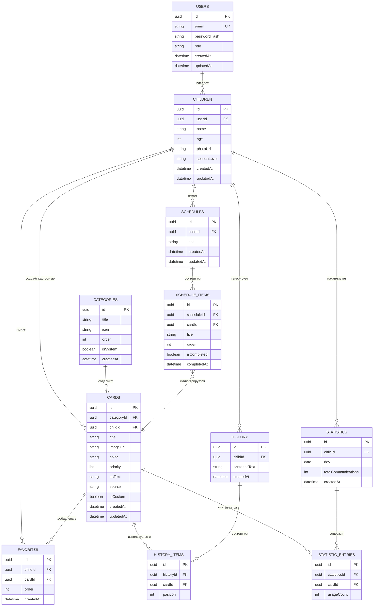

# DATABASE.md — Autism Connect MVP

СУБД: **PostgreSQL**. ORM: **Prisma**. Все сущности из раздела 12 ТЗ + служебные таблицы, необходимые для реализации связей (`Favorites` как связка many-to-many, `ScheduleItems` как элементы расписания).

---

## 1. ER-диаграмма

---

## 2. Описание таблиц

### 2.1 `users`
Родитель/специалист, аутентифицируется через email + JWT.

| Поле | Тип | Описание |
|---|---|---|
| id | UUID (PK) | |
| email | string, unique | |
| passwordHash | string | bcrypt/argon2 хэш |
| role | enum: `PARENT`, `SPECIALIST`, `ADMIN` | задел под роль специалиста (Phase 2) |
| createdAt / updatedAt | datetime | |

### 2.2 `children`
Профиль ребёнка, привязан к родителю.

| Поле | Тип | Описание |
|---|---|---|
| id | UUID (PK) | |
| userId | UUID (FK → users.id) | |
| name | string | |
| age | int | |
| photoUrl | string, nullable | |
| speechLevel | enum: `NONE`, `SINGLE_WORDS`, `PHRASES`, `SENTENCES` | |
| favoriteCategories | связь many-to-many с `categories` через join-таблицу `child_favorite_categories` (см. ниже) | |

> Примечание: "Любимые категории" из раздела 6.2 ТЗ реализуются отдельной join-таблицей `child_favorite_categories(childId, categoryId)`, а не полем-массивом, чтобы сохранить нормализацию и связь с реальными категориями.

### 2.3 `categories`
Системные категории (Еда, Напитки, Игрушки и т.д.) + возможность добавления новых через админку.

| Поле | Тип | Описание |
|---|---|---|
| id | UUID (PK) | |
| title | string | |
| icon | string | emoji или ссылка на иконку |
| order | int | порядок отображения |
| isSystem | boolean | защита базовых категорий от удаления через UI |

### 2.4 `cards`
Ключевая сущность. Минимум 300 штук в базовой библиотеке (сеется миграцией/seed-скриптом, не хардкодится в коде приложения).

| Поле | Тип | Описание |
|---|---|---|
| id | UUID (PK) | |
| categoryId | UUID (FK → categories.id) | |
| childId | UUID (FK → children.id), nullable | заполняется только для кастомных карточек конкретного ребёнка (раздел 6.12 ТЗ); NULL — карточка из общей библиотеки |
| title | string | |
| imageUrl | string | путь в MinIO/S3 |
| color | string | hex |
| priority | int | влияет на сортировку |
| ttsText | string | текст для озвучивания (может отличаться от title) |
| source | enum: `LIBRARY`, `CUSTOM`, `AI_GENERATED` | задел под Phase 2/3 AI-генерацию (раздел 14 ТЗ) без изменения схемы |
| isCustom | boolean | быстрый флаг для выборок "мои карточки" |

### 2.5 `favorites`
Закреплённые карточки конкретного ребёнка (раздел 6.7 ТЗ).

| Поле | Тип |
|---|---|
| id | UUID (PK) |
| childId | UUID (FK) |
| cardId | UUID (FK) |
| order | int — порядок отображения "первыми" |

Уникальный составной индекс `(childId, cardId)`, чтобы карточка не дублировалась в избранном.

### 2.6 `history` / `history_items`
Хранение последних 100 предложений на ребёнка (раздел 6.10 ТЗ).

- `history` — само предложение целиком (для быстрого вывода списком): `sentenceText`, `createdAt`.
- `history_items` — из каких именно карточек (в каком порядке) собрано предложение — для статистики использования карточек.

Ограничение "последние 100" реализуется не на уровне схемы, а как правило приложения (background job или триггер очистки старых записей свыше 100 на `childId`), либо через партиционирование/lazy-cleanup в сервисе `HistoryModule`.

### 2.7 `schedules` / `schedule_items`
Визуальное расписание (раздел 6.11 ТЗ).

- `schedules` — расписание (может быть несколько шаблонов на ребёнка: "утро", "вечер").
- `schedule_items` — шаги расписания по порядку, каждый опционально привязан к карточке (`cardId`) для иллюстрации шага, с флагом `isCompleted` и `completedAt` — что отмечает ребёнок.

### 2.8 `statistics` / `statistic_entries`
Агрегированная статистика по дням (раздел 6.13 ТЗ).

- `statistics` — одна запись на ребёнка на день: `totalCommunications`.
- `statistic_entries` — разбивка по карточкам за этот день: `usageCount` на каждую `cardId`.

Такое разделение позволяет строить и "активность по дням" (агрегат `statistics`), и "самые используемые карточки" (агрегат по `statistic_entries` за период) без пересчёта из сырой истории на каждый запрос.

---

## 3. Индексы

- `users.email` — unique index.
- `children.userId` — index (быстрая выборка детей родителя).
- `cards.categoryId`, `cards.childId` — index.
- `cards.title` — index (используется в поиске, раздел 6.6 ТЗ); при росте библиотеки рассмотреть `pg_trgm` для поиска по подстроке.
- `favorites (childId, cardId)` — unique composite index.
- `history.childId, createdAt` — composite index (для быстрой выборки последних N).
- `schedule_items.scheduleId, order` — composite index.
- `statistics (childId, day)` — unique composite index.

---

## 4. Принципы работы со схемой

1. **Ничего не хардкодится.** Категории и базовая библиотека карточек (300+) поставляются как **seed-скрипт** (`packages/database/prisma/seed.ts`), а не как enum или JSON в коде приложения — админ должен иметь возможность их редактировать через UI после первого запуска.
2. **Все связи — через явные внешние ключи**, никаких "мягких" ссылок по строкам.
3. **Мягкое удаление (soft delete)** рекомендуется для `cards` и `categories` (поле `deletedAt`), чтобы не ломать историческую `history`/`statistics` при удалении карточки, которая уже использовалась.
4. **Миграции** — только через `prisma migrate dev` / `prisma migrate deploy`, ручные правки схемы в БД запрещены.
5. **Расширяемость под AI:** поле `source` в `cards` и потенциальные будущие таблицы (`social_stories`, `exercises`, `marketplace_items`) проектируются по той же схеме "категория → элемент → использование/статистика", что и `cards`, для консистентности будущего low-code конструктора (раздел 17 ТЗ).
